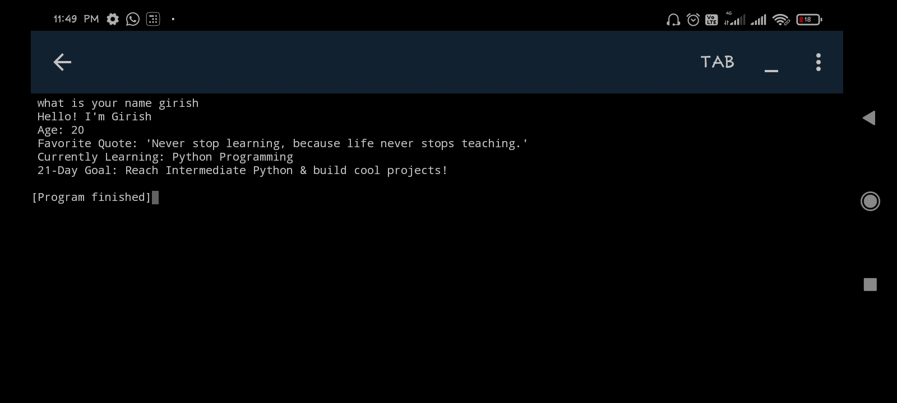

# 🚀 My First Python Program – Girish's Introduction Script


Welcome to my first ever Python project! This simple yet interactive script introduces "Girish" if the correct name is entered. It's my **Day 1** in the world of Python programming. 🐍

---

## Screenshot

🎬 Terminal Output Example:



---

## 🧭 Table of Contents

- [📌 About](#about)
- [⚙️ How It Works](#how-it-works)
- [🚀 Getting Started](#getting-started)
- [📸 Screenshot](#screenshot)
- [🎯 Goals](#goals)
- [📬 Connect With Me](#connect-with-me)
- [⭐ Fun Fact](#fun-fact)

---

## About

This is a beginner-friendly Python script where the user is asked to enter a name. If the name matches "Girish", it reveals some cool personal details. Otherwise, it shows an error-style message.

---

## How It Works

- Takes user input via `input()`
- Converts it to lowercase using `name.lower()`
- Checks if it matches "girish"
- If it matches, prints an introduction
- If not, prints a rejection message

---

## Getting Started

> Make sure you have **Python 3.x** installed.

###  Steps:

1. Clone this repository:
   ```bash
   git clone
   ```

2. Navigate to the project folder:

3. Run the Python file:

---

## Goals

✅ Learn Python basics

✅ Build first Python script

🔜 Explore if, else, functions, loops

🔜 Start making fun projects


---

##  Connect With Me

🔗 [LinkedIn]()

🐙 [GitHub]()

✉️ girishmohakarentc@gmail.com


---

## Fun Fact

> “Every expert was once a beginner. Keep coding!” 💻


---
